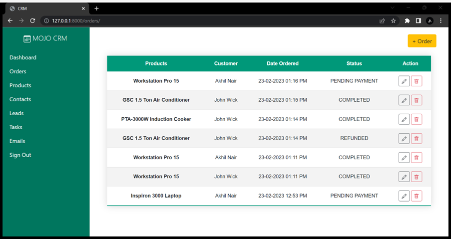
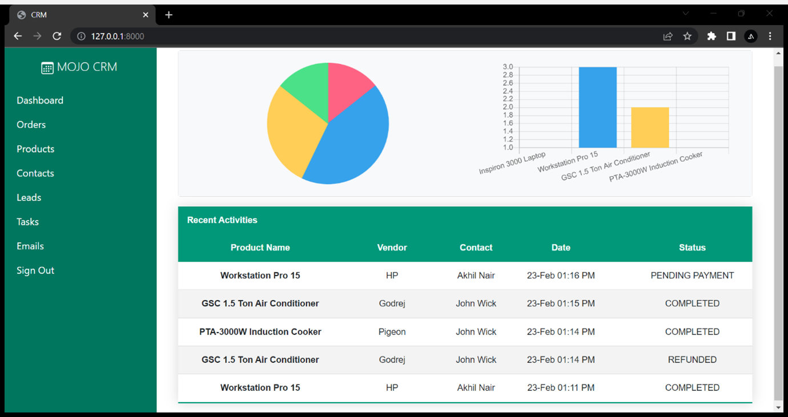
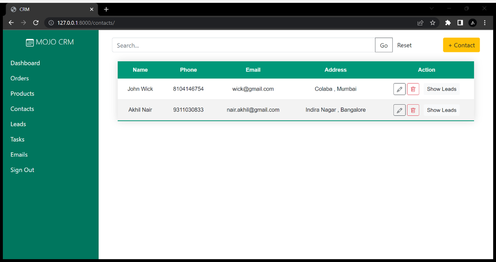
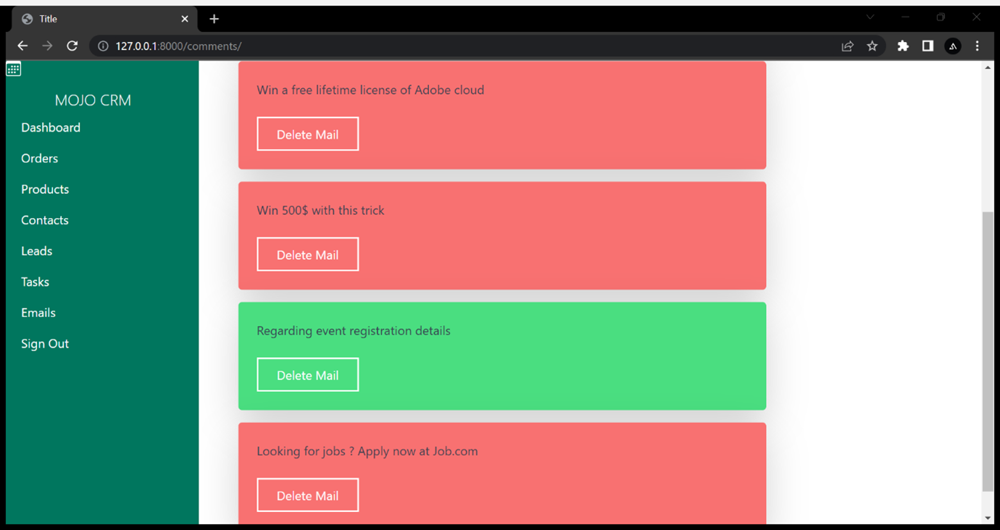
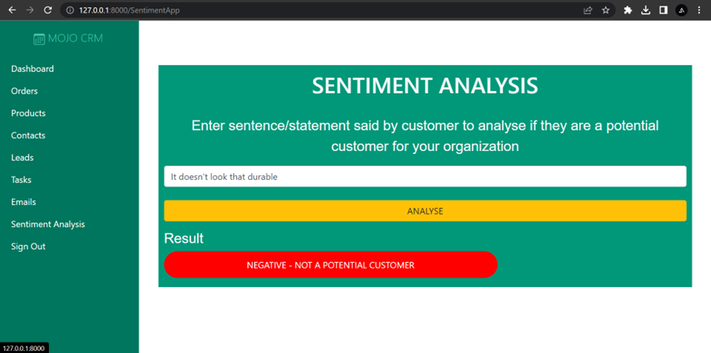

# MOJO CRM - An AI enabled CRM system
# AI-Enhanced CRM System

This project is an AI-powered Customer Relationship Management (CRM) system designed to improve the accuracy of CRM data using Natural Language Processing (NLP) and Machine Learning models. The system provides both a frontend dashboard and a FastAPI-based backend. AI capabilities include sentiment analysis, predictive text generation, and data validation to help streamline CRM workflows.

---

## 🔍 Introduction

Traditional CRM systems rely heavily on manual data entry and rule-based systems, often resulting in inaccurate or outdated information. Our solution integrates AI to automate tasks like sentiment detection, data validation, and intelligent prediction of missing data. This leads to better decision-making, improved customer insights, and reduced manual overhead.

---

## 🎯 Objective

To develop an AI-enabled CRM system that enhances the accuracy, reliability, and usability of customer data through:
- AI-based validation and correction of input fields.
- Sentiment analysis of customer feedback.
- Prediction of missing customer details.
- A user-friendly dashboard for visualization and model management.

---

## ⚙️ Tools & Technologies

| Area | Tools Used |
|------|------------|
| Backend | FastAPI, Transformers, PyTorch, Datasets |
| Frontend | React.js, Chart.js, TailwindCSS |
| AI Models | HuggingFace Transformers (`gpt2`, `distilbert`) |
| Misc | Python, JavaScript, HTML/CSS |

---

## 🖥️ Software & Hardware Requirements

**Software Requirements:**
- Python 3.8+
- Node.js 16+
- npm or yarn
- Git
- VS Code or any IDE

**Hardware Requirements:**
- 8 GB RAM minimum
- CPU with 4 cores or more (GPU recommended for model training)
- 20 GB disk space

---

## 📊 Project Features

### Backend Features (FastAPI)
- AI-Powered Sentiment Analysis
- Predict Missing CRM Fields
- Validate Input Data
- Train Models using Huggingface Transformers
- JSON-based API Responses

### Frontend Dashboard Features (React)
- Submit CRM data to the backend for validation and sentiment analysis
- Monitor training status and logs
- View visualizations like accuracy over time and feedback sentiment distribution
- Responsive layout styled with TailwindCSS

---

## 📈 Data Analytics - Short Overview

Data analytics refers to techniques for analyzing raw data to find trends and answer questions. Using methods from statistics, machine learning, and business intelligence, data analytics turns data into actionable insights. The core types include descriptive, diagnostic, predictive, and prescriptive analytics.

---

## ⭐ Key Features of Data Analytics

- Data Collection & Integration
- Data Cleaning & Preprocessing
- Descriptive, Predictive & Prescriptive Analytics
- Real-Time Processing & Visualization
- AI & ML Integration for Smart Decision Making
- Secure & Compliant Data Handling

---

## 📘 Outcome of the Project

- Reduced manual errors in CRM data.
- Automated insights into customer sentiments.
- Efficient user interaction via chatbot and frontend dashboard.
- A scalable architecture for deploying on cloud platforms like IBM Watson.

---

## 📌 Conclusion & Future Scope

This AI-Enhanced CRM system demonstrates the power of NLP and machine learning in improving CRM workflows. The current version focuses on sentiment analysis, validation, and predictive modeling. Future improvements may include:
- Speech-to-text analysis for call data.
- Advanced spam classification in email integration.
- Deeper customer behavior analytics.

---

## 📚 References

| Title | Author(s) | Year |
|-------|-----------|------|
| Attention Is All You Need | Vaswani | 2017 |
| Applied Text Analysis with Python | Benjamin Bengfort | 2018 |
| BERT: Pre-training of Deep Bidirectional Transformers for Language Understanding | Jacob Devlin | 2019 |
| Huggingface Transformers Library | Huggingface | Ongoing |

---

## 👤 Contributors
- **Varun Yadav G** - Developer
- **Abhishek P** - Developer
- **Rishika Jha** - Developer
- **Rachana S** - Developer

### Screenshots

<table>
  <tr>
  <td align="center">
      
       
      
Orders

    </td>
    <td align="center">
      
       
      
Dashboard

    </td>
    <td align="center">
      
       
      
Contacts

    </td>
    <td align="center">
      
       
      
Email Spam Filtering

    </td>
    <td align="center">
      
       
      
Sentiment Analysis

    </td>
    </tr>
</table>

